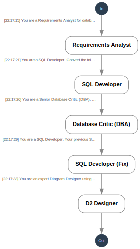

# 🏛️ Autonomous DB-Architect

An autonomous multi-agent AI pipeline that directly translates natural language requirements into production-ready SQLite database schemas and visualizations.

## 🚀 How It Works (The Multi-Agent Workflow)
Instead of relying on monolithic LLM prompts, this project utilizes a chained, role-based architecture.

1. **Requirements Analyst:** Parses human language into structured `JSON` relationships.
2. **SQL Developer:** Translates the struct into raw `SQLite DDL`.
3. **The Reflection Loop (Critic + Tool Use):** The system attempts to safely execute the generated SQL inside an in-memory `SQLite3` engine. If it crashes, a secondary **DBA Critic Agent** reads the raw error message, analyzes the hallucination/typo, and forces the Developer to fix it—looping autonomously until `100% Valid SQL` is verified!
4. **D2 Designer:** Validated schema is piped into an AI Designer to compile structured `d2lang` diagram files dynamically.

## 💡 Examples
Check out our **[Example Prompts](example_prompts.md)** to see complex architectures (E-commerce, Hospital, HR System, etc.) you can generate with a single sentence!

## 🛠 Tech Stack
- **Python / SQLite** (Self-validation runtime Tool Use)
- **OpenAI API / Gemini** (Routed natively via `litellm` - zero dependency on heavy frameworks like LangChain)
- **d2lang** (Declarative diagramming)

## ⚡ Running Locally

1. Set your secret API key:
   Update `os.environ["OPENAI_API_KEY"] = "sk-..."` in `main.py`
2. Install dependencies:
   `pip install -r requirements.txt`
3. Run the architect:
   `python main.py`
